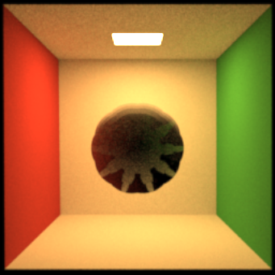

# Gaussian Process Implicit Surface (GPIS) Shape Plugin for Mitsuba3

This project implements a Gaussian Process Implicit Surface (GPIS) shape plugin for the [Mitsuba3 renderer](https://github.com/mitsuba-renderer/mitsuba3). The underlying algorithm is derived from the paper: "From Microfacette to participating media: a unified theory of light transport" by Seyb et al.



## Plugin Overview: `GpisSphere`

The `GpisShape` plugin consists of two main components:

- A simple `gaussian_process.h` library, implemented using the DrJit syntax.
- A custom shape called `gpis_sphere`.

This shape is compiled and linked with Mitsuba3. The resulting `gpisSphere.so` shared library is then moved to Mitsuba3's build plugin directory. This allows the plugin to be used directly within Mitsuba3 scene XML descriptions, maintaining a clear separation from the external Mitsuba3 dependency.

## Building the Project

The project requires Mitsuba3 to be compiled first, so its dependencies are inherited. The primary dependencies include:

- **CMake**: Version 3.28
- **GCC**: Version 13
- **Ninja**: Version 11

For ease of setup, a `flake.nix` file is provided to configure a compatible development environment. You can activate it by running:

```bash
nix develop
```

Once the environment is set up, or if you have the dependencies installed manually, follow these steps to build:

```bash
cmake -B build
cmake --build build
```

## Running the Renderer

After a successful build, the Mitsuba3 executable can be found at `build/external/mitsuba3/mitsuba3`. You can run it with any of the scene files located in the `scenes` directory.

To render a simple Utah teapot test scene:

```bash
./build/external/mitsuba3/mitsuba3 scenes/scene.xml
```

To render the `gpis_sphere` scene:

```bash
./build/external/mitsuba3/mitsuba3 scenes/gpis_scene.xml
```

Alternatively, you can use the following CMake targets for convenience:

- **Render the `gpis_sphere` scene and convert the output to PNG:**
    
    ```bash
    cmake --build build --target render
    ```
    
    This command will generate an OpenEXR file and then convert it to a PNG image.
    
- **View the generated PNG render:**
    
    ```bash
    cmake --build build --target view
    ```
